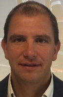
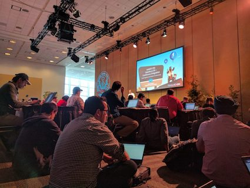

# AppDynamics Starter Plan

📍*Concept Starter plan for the first fiscal year within AppDynamics.*

## Who am I?

Name: Jules Weijters 
Born: 04-02-1973 
Location: Utrecht, The Netherlands 
Employer: Salesforce since 01-10-2016 
Role: Cloud Architect for the Salesforce Platform 
Region: Europe North 
Experience: Over 20 years in the Information Technology industry. Worked for 10 years in the IT and Developer Operations market with Oracle in EMEA. Last 1,5 year within Oracle, primary EMEA technical resource for the newly introduced Oracle Cloud Management solution (APM, Infrastructure Monitoring, Log Analytics and IT Analytics) responsible for evangelism and enablement across customers, partner ecosystem and Oracle solution engineering teams.
Currently in Salesforce helping customer in EMEA North getting business value from the Salesforce platform focussing on security, integration and (low-code) development. 
Drive: Passionate about innovative technical solutions and enabling customer and/or partner success. 
LinkedIn: [www.linkedin.com/in/julesweijters](http://www.linkedin.com/in/julesweijters) 
Resume: [Resume](EN.CURRICULUM.VITAE.201803.pdf)

**Fun fact:** In Tel Aviv for business during the first time Gaza rockets reached the city, http://www.news.com.au/national/victoria/on-the-ground-in-tel-aviv-as-hamas-rockets-reach-israels-second-largest-city/news-story/e62444ba27af7da3f183ecd4e8fbbd6a. Had no clue what was happening until it was over, never maid it to a shelter and saw the record hit the shore. 

*Example of delivery in 2017 during [TrailheaDX](https://developer.salesforce.com/trailheadx), the yearly Salesforce Developer conference:*
”There was also a workshop run by Jules Weijters called **Salesforce DX and Continuous Integration**, that showed how to use Salesforce DX and Travis as CI systems. This was one of my highlighted sessions to attend. Unfortunately the session was so packed that the WiFi couldn’t provide internet for all of us and I couldn’t do the workshop. A real shame.” — Source external [blog](https://labs.ebury.rocks/2017/07/12/trailheadx-2017-highlights/)
Countdown for FY19

### Link to result of labs excercises during recruitment, [AppD Labs](AppDLabs.pdf)

## My Partner Sales engineer role within AppDynamics

### VISION

📍*How do I want to execute the role of  Partner Sales Engineer within AppDynamics.*

Be the 'go-to' expert for technical partner enablement and support in EMEA North. Being a trusted advisor for partners and AppDynamics sales teams by bringing clear added value through a deep passion for AppDynamics technology and achieving shared success with partners. 
Making an impact to growth in the channel business in EMEA North by investing time to deeply understand the strategic partners' business, needs and challenges and deliver targeted enablement and support that ensures their success.

### VALUES

📍*What do I see as important for achieving the vision together with business partners.*

* Be a trusted technology expert for the partner eco system;
* Evangelize, inspire and guide business partners, through technical expertise, to deliver innovation and value based on the AppDynamics Solution portfolio;
* Ensure that all enablement and support have the best interests of the partners and AppDynamics in mind and can scale across the region. Work actively with Marketing teams where applicable;
* Be driven by openness, transparency and success as the foundation for each and every interaction with partners;
* Collect and structure partner product feedback based on business value to provide to Product Management and Engineering; 
* Speak through the quality of my work. Define clear goals, execute to the best of my abilities and finish what I start;
* Continuously learn, update and extend skills to stay a leader in the IT and Development Operations market place;
* Share knowledge within the wider Partner SE and SE community.

### Methods

📍*How do I plan to execute against the vision and embed the values. Methods should be measurable.*

On-boarding, first 3 months:

* Create a 'living' learning path to build up knowledge to be the trusted technology expert in H2, to be reviewed bi-weekly with SE Management. Elements of that plan:
    * On-boarding,
    * Formal training,
    * Peer certification,
    * Shadowing,
    * Co-delivering.
* Have weekly progress and feedback sessions with my manager.
* Build a ambitious but achievable plan together with the region Partner Sales and SE Management for achieving partner success in H2 with key partners.

Evangelize, second half FY:

* Have a set learning path and career plan.
* Engage in and setup regular and structured activities with at least 4 key partners to built trusted and strong relationships.
* Create and deliver key content for partner enablement at least monthly to built a regional partner community.
* Deliver against the plan for achieving partner success, track monthly progress.
* Participate in at least 2 partner facing events driven by Marketing.
* Organize or deliver during at least 2 internal knowledge share sessions.
* Create a minimum of 3 blog post on partner success with AppDynamics solutions.
* Built or use a structured high-value content delivery method (partner academy), at least in the planning phase with concrete outcomes defined.

### Obstacle

📍*What would block me from achieving the vision or fully completing the methods.*

* Not being hired by AppDynamics!
* Having misinterpreted the Partner Solution Engineering role and misaligned the vision, leads to a new and qualified Starter Plan.
* A growing organization with shifting priorities can influence the vision and outcome.

### Progress Tracker

Show progress against Methods
- [ ] Approved Starter Plan
- [ ] Weekly progress and feedback
- [ ] Learning path
- [ ] Delivering partner success
- [ ] Career Plan
- [ ] Content creation
- [ ] Community building
- [ ] Weekly progress and feedback
- [ ] Knowledge share
### 

